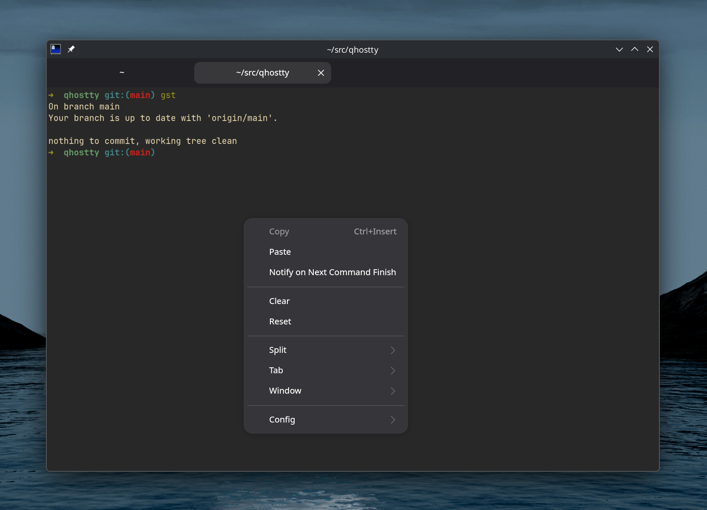
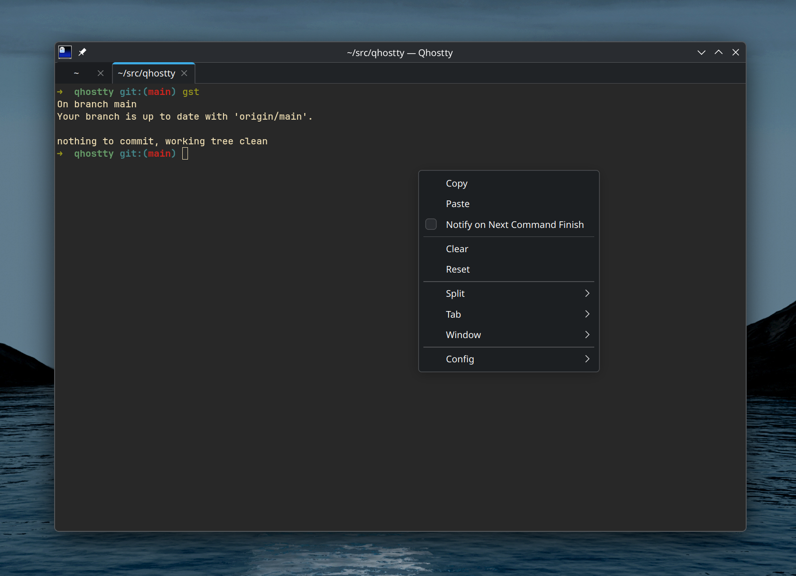

# Qhostty

Qhostty is an experimental native Qt 6 frontend for the [Ghostty](https://ghostty.org/) terminal core. It targets KDE Plasma on Linux and does not use GTK or libadwaita at runtime.

## GTK vs Qt on KDE Plasma

The terminal configuration and content are the same. Only the Linux frontend changes. Select an image to view it at full size.

<table>
  <tr>
    <th>Ghostty · GTK</th>
    <th>Qhostty · Qt 6</th>
  </tr>
  <tr>
    <td><a href="docs/screenshots/ghostty-gtk.png"></a></td>
    <td><a href="docs/screenshots/qhostty-qt.png"></a></td>
  </tr>
</table>

Qhostty currently provides:

- Ghostty terminal, PTY, font, configuration, and OpenGL rendering
- Native Qt windows, detachable tabs, nested splits, search, and title UI
- Keyboard, IME, mouse, smooth scrolling, focus, both clipboards, DPI, and resize handling
- Single-instance activation with working-directory and command forwarding
- A persistent quick terminal with Plasma Wayland and X11 integration
- KDE global shortcuts for Ghostty `global:` bindings when KGlobalAccel is available
- A searchable command palette and an OpenGL terminal inspector
- Per-surface readonly, key-state, progress, scrollbar, child-exit, and renderer-health UI
- Command-finished notifications, desktop notifications, URLs, terminal export, and close confirmation
- Plasma launcher metadata, AppStream metadata, icons, and a Dolphin service action

## What Qt replaces

GTK4 becomes Qt 6 Widgets: `QOpenGLWidget` for the terminal surface, `QSplitter` for splits, `QTabBar` for tabs, `QMessageBox` for dialogs.

libadwaita is dropped rather than reimplemented. Its widgets become plain Qt ones, and its styling role falls to the desktop's own Qt style, which is Breeze under Plasma. That is why Qhostty looks native on KDE without depending on anything from KDE.

The optional KDE Frameworks packages cover only what Qt has no portable API for: quick-terminal placement and layering (LayerShellQt), the quick-terminal slide effect and X11 window state (KF6WindowSystem), and global shortcuts (KF6GlobalAccel). Kirigami is not used.

## Build

Requirements: Zig 0.16, CMake 3.25 or newer, Ninja, Qt 6.5 or newer with Core, DBus, Gui, Network, Widgets, OpenGL, and OpenGLWidgets, Fontconfig, a C++20 compiler, and OpenGL 4.3.

LayerShellQt, KF6WindowSystem, and KF6GlobalAccel are optional at build time. They enable exact Plasma quick-terminal placement, KWin effects, and KDE global shortcuts.

```sh
cmake -S qt -B build/qt -G Ninja \
  -DCMAKE_BUILD_TYPE=Debug \
  -DBUILD_TESTING=ON
cmake --build build/qt --parallel
build/qt/qhostty +version
build/qt/qhostty
```

For a portable release build:

```sh
cmake -S qt -B build/qt-release -G Ninja \
  -DCMAKE_BUILD_TYPE=Release \
  -DQHOSTTY_GHOSTTY_OPTIMIZE=ReleaseFast \
  -DQHOSTTY_GHOSTTY_CPU=baseline
cmake --build build/qt-release --parallel
```

Install into a staging directory:

```sh
DESTDIR="$PWD/pkgroot" cmake --install build/qt-release --prefix /usr
```

The installed executable uses a private `libghostty.so` under `lib/qhostty`.

## Validation

```sh
ctest --test-dir build/qt --output-on-failure
! ldd build/qt/qhostty | grep -E 'libgtk|libadwaita'
```

A Plasma Wayland smoke test must cover shell rendering, keyboard shortcuts, IME preedit and commit, selection, both clipboards, mouse-reporting applications, scrolling, tabs, nested splits, window creation, configuration reload, 100% and fractional scaling, and clean shutdown.

## Platform limits

- Plasma Wayland is the primary target. Plasma X11 receives build and startup smoke coverage.
- Exact Wayland quick-terminal placement and layering require LayerShellQt. Without it, Qhostty uses a normal frameless tool window because Wayland clients cannot choose their own global position.
- Global shortcuts require KF6GlobalAccel and Plasma approval. Other desktops need their own shortcut integration.
- Single-instance forwarding supports working directory, title, font size, command, initial input, wait behavior, and `-e` command arguments. Arbitrary per-window Ghostty CLI configuration is not replayed in the running process.
- Secure keyboard entry has no reliable Linux equivalent. Structural undo/redo, background-only opacity toggling, and built-in update checks are reported as unsupported and omitted from the command palette.
- Floating and activation requests remain subject to the Wayland compositor's focus and stacking policy.
- The package temporarily reuses Ghostty's icon and depends on Ghostty terminfo and shell-integration packages.
- NVIDIA, ibus, fcitx, CJK input, and 200% scaling still need broader manual hardware coverage.

See [PLAN.md](PLAN.md) for the roadmap. Qhostty is independent from the official Ghostty project and uses the [MIT license](LICENSE).
